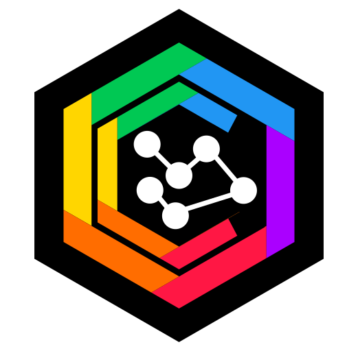

<link href="./assets/styles/markdown.css" rel="stylesheet"></link>
<link href="./assets/styles/color.css" rel="stylesheet"></link>
<link href="./assets/styles/grid.css" rel="stylesheet"></link>

<div><center></center></div>
<div><center></center></div>
<hr class="blue" style="height: 5px; margin-top: 0;">
<div class="blue-text" style="position:relative;text-align:right;">
  <span>
    initialis idea - ide awal
  </span><br>
  <span>
    in profectum - dalam progress
  </span><br>
  
  <span class="accent blue dark-4 white-text">
    dum finitur - sementara dinyatakan selesai
  </span>
</div>
<br><br><br>
<center>

# Theme Switcher - 2nd Attempt

<span class="accent blue dark-4 white-text"><strong>Catalyst Taskforce</strong> ~ Apr 03, 2023: Last Updated Apr 08, 2023</span>

<hr class="blue" style="height: 5px; margin-bottom: 0;">
</center>
<br>

Pengamatan terhadap struktur dan content code aplikasi menyatakan bahwa: `src/app.html` adalah `pages wrapper`. Sedangkan `src/routes/+layout.svelte` dapat disebut sebagai `components wrapper`. Keduanya hakikatnya bermakna sama, semuanya berperan sebagai wrapper seluruh application content walau dengan derajat yang berbeda.

Karena `+layout.svelte` tidak dapat menjangkau `<body>`, maka dengan asumsi pada paragraph di atas: Seharusnya "theme-switcher" dapat diletakkan di `+layout.svelte` dan `<div>` terluarnya dapat berperan sebagai `component-wrapper`. `data-theme` attribute pada `<body>` dapat didelegasikan ke `<div>` terluar `+layout.svelte`.

## <div class="blue-text">Implementation</div>

`app.html`

```html
<!DOCTYPE html>
<html lang="en">
	<head>
		<meta charset="utf-8" />
		<meta name="viewport" content="width=device-width, initial-scale=1.0" />
		<link rel="icon" sizes="32x32" href="%sveltekit.assets%/favicons/catalyst.32.png" />
		<link rel="icon" sizes="96x96" href="%sveltekit.assets%/favicons/catalyst.96.png" />
		<link rel="icon" sizes="128x128" href="%sveltekit.assets%/favicons/catalyst.128.png" />
		<link rel="icon" sizes="180x180" href="%sveltekit.assets%/favicons/catalyst.180.png" />
		<link rel="icon" sizes="192x192" href="%sveltekit.assets%/favicons/catalyst.192.png" />
		<link rel="stylesheet" type="text/css" href="%sveltekit.assets%/styles/layout.grid.css" />
		<link rel="stylesheet" type="text/css" href="%sveltekit.assets%/styles/color.system.css" />
		<link rel="stylesheet" type="text/css" href="%sveltekit.assets%/styles/theme.switcher.css" />
		<link rel="stylesheet" type="text/css" href="%sveltekit.assets%/styles/fonts.css" />
		<style>
			html,
			body {
				height: 100%;
				margin: 0;
				padding: 0;
			}
		</style>
		%sveltekit.head%
	</head>
	<body class="membrane" data-sveltekit-preload-data="hover">
		%sveltekit.body%
	</body>
</html>
```

`+layout.svelte`

```html
<script lang="ts">
	let selectedTheme: string = 'purple-dark'; // default theme

	const changeTheme = (event: Event) => {
		const target = event.target as HTMLInputElement;
		selectedTheme = target.value;
	};
</script>

<div id="components-wrapper" class="membrane" data-theme="{selectedTheme}">
	<slot></slot>
	<!-- Switcher -->
	<input
		type="radio"
		id="indigo-light"
		name="themes"
		value="indigo-light"
		on:change="{changeTheme}"
	/>
	<input
		type="radio"
		id="indigo-dark"
		name="themes"
		value="indigo-dark"
		on:change="{changeTheme}"
	/>
	<input
		type="radio"
		id="purple-light"
		name="themes"
		value="purple-light"
		on:change="{changeTheme}"
	/>
	<input
		type="radio"
		id="purple-dark"
		name="themes"
		value="purple-dark"
		on:change="{changeTheme}"
		checked
	/>
	<div class="wrapper">
		<div class="color-palette">
			<label for="indigo-light"></label>
			<label for="indigo-dark"></label>
			<label for="purple-light"></label>
			<label for="purple-dark"></label>
		</div>
	</div>
</div>

<style>
	#components-wrapper {
		height: 100%;
		width: 100%;
	}
</style>
```

Perhatian:

- `checked` attribute pada radio button harus disesuaikan dengan `selectedTheme`.

- Karena possibility jumlah themes banyak, sebaiknya di pengembangan selanjutnya menggunakan `<option>` atau yang setara dengannya.

- Theme switcher sebaiknya menjadi bagian dari `navigator`.

<div class="blockquote-note">
    <br/>
    <p>
      Agar implementasi <span class="accent">membrane</span> terkesan pada seluruh body, harus dipastikan agar tinggi body defaultnya <span class="accent">100vh</span>. Dan component-wrapper tinggi minimum-nya juga 100vh.
    </p>
</div>

<hr class="blue" style="height: 5px; margin-bottom: 0;">
<div class="footer blue-text">
  <div style="text-align: center; padding-top: 5px;"><strong>The <span style="font-size: 1.5em;">A</span> Taskforce</strong></div>
  <div class="footer-inner">
    <div class="avatar inline L">
      <svg 
          xmlns="http://www.w3.org/2000/svg" 
          xmlns:xlink="http://www.w3.org/1999/xlink" 
          x="0px" y="0px" width="100%" height="100%"
          position="absolute" top="0px" left="0px"
          viewBox="87.5 87.5 65 73"
          xml:space="preserve"
      >
          <defs>
              <pattern id="profile-0" height="100%" width="100%" patternContentUnits="objectBoundingBox" viewBox="0 0 1 1" preserveAspectRatio="xMidYMid slice">
                <image height="1" width="1"  preserveAspectRatio="xMidYMid slice" xlink:href="./assets/images/profiles/dani.agus.sulistyanto.avif" />
              </pattern> 
          </defs>
          <path fill="url(#profile-0)" d="M122.6,159.883c-1.431,0.822-3.77,0.822-5.201,0l-27.298-15.701c-1.431-0.822-2.601-2.84-2.601-4.483v-31.397 c0-1.647,1.17-3.662,2.601-4.484l27.298-15.7c1.431-0.823,3.77-0.823,5.201,0l27.301,15.7c1.431,0.822,2.6,2.837,2.6,4.484v31.397 c0,1.644-1.169,3.661-2.6,4.483L122.6,159.883z"/>
          <path fill="transparent" stroke="white" stroke-width=".75" d="M146.38,105.483l-23.467-13.498c-0.785-0.452-1.819-0.7-2.912-0.7c-1.094,0-2.128,0.249-2.911,0.7 L93.62,105.483c-1.605,0.922-2.911,3.173-2.911,5.018v26.99c0,1.847,1.306,4.1,2.91,5.024l23.472,13.5 c0.784,0.45,1.817,0.699,2.909,0.699c1.091,0,2.125-0.249,2.913-0.699l23.468-13.5c1.605-0.927,2.912-3.18,2.912-5.024v-26.99 C149.293,108.658,147.985,106.406,146.38,105.483z"/>
      </svg>
    </div>
    <div class="avatar inline L">
      <svg 
          x="0px" y="0px" width="100%" height="100%"
          position="absolute" top="0px" left="0px"
          viewBox="87.5 87.5 65 73"
          xml:space="preserve"
      >
          <defs>
              <pattern id="profile-1" height="100%" width="100%" patternContentUnits="objectBoundingBox" viewBox="0 0 1 1" preserveAspectRatio="xMidYMid slice">
                <image height="1" width="1"  preserveAspectRatio="xMidYMid slice" xlink:href="./assets/images/profiles/emond.suwandi.avif" />
              </pattern> 
          </defs>
          <path fill="url(#profile-1)" d="M122.6,159.883c-1.431,0.822-3.77,0.822-5.201,0l-27.298-15.701c-1.431-0.822-2.601-2.84-2.601-4.483v-31.397 c0-1.647,1.17-3.662,2.601-4.484l27.298-15.7c1.431-0.823,3.77-0.823,5.201,0l27.301,15.7c1.431,0.822,2.6,2.837,2.6,4.484v31.397 c0,1.644-1.169,3.661-2.6,4.483L122.6,159.883z"/>
          <path fill="transparent" stroke="white" stroke-width=".75" d="M146.38,105.483l-23.467-13.498c-0.785-0.452-1.819-0.7-2.912-0.7c-1.094,0-2.128,0.249-2.911,0.7 L93.62,105.483c-1.605,0.922-2.911,3.173-2.911,5.018v26.99c0,1.847,1.306,4.1,2.91,5.024l23.472,13.5 c0.784,0.45,1.817,0.699,2.909,0.699c1.091,0,2.125-0.249,2.913-0.699l23.468-13.5c1.605-0.927,2.912-3.18,2.912-5.024v-26.99 C149.293,108.658,147.985,106.406,146.38,105.483z"/>
      </svg>
    </div>
    <div class="avatar inline L">
      <svg 
          x="0px" y="0px" width="100%" height="100%"
          position="absolute" top="0px" left="0px"
          viewBox="87.5 87.5 65 73"
          xml:space="preserve"
      >
          <defs>
              <pattern id="profile-2" height="100%" width="100%" patternContentUnits="objectBoundingBox" viewBox="0 0 1 1" preserveAspectRatio="xMidYMid slice">
                <image height="1" width="1"  preserveAspectRatio="xMidYMid slice" xlink:href="./assets/images/profiles/annisa.jodiyosa.avif" />
              </pattern> 
          </defs>
          <path fill="url(#profile-2)" d="M122.6,159.883c-1.431,0.822-3.77,0.822-5.201,0l-27.298-15.701c-1.431-0.822-2.601-2.84-2.601-4.483v-31.397 c0-1.647,1.17-3.662,2.601-4.484l27.298-15.7c1.431-0.823,3.77-0.823,5.201,0l27.301,15.7c1.431,0.822,2.6,2.837,2.6,4.484v31.397 c0,1.644-1.169,3.661-2.6,4.483L122.6,159.883z"/>
          <path fill="transparent" stroke="white" stroke-width=".75" d="M146.38,105.483l-23.467-13.498c-0.785-0.452-1.819-0.7-2.912-0.7c-1.094,0-2.128,0.249-2.911,0.7 L93.62,105.483c-1.605,0.922-2.911,3.173-2.911,5.018v26.99c0,1.847,1.306,4.1,2.91,5.024l23.472,13.5 c0.784,0.45,1.817,0.699,2.909,0.699c1.091,0,2.125-0.249,2.913-0.699l23.468-13.5c1.605-0.927,2.912-3.18,2.912-5.024v-26.99 C149.293,108.658,147.985,106.406,146.38,105.483z"/>
      </svg>
    </div>
      <div class="avatar inline L">
      <svg 
          x="0px" y="0px" width="100%" height="100%"
          position="absolute" top="0px" left="0px"
          viewBox="87.5 87.5 65 73"
          xml:space="preserve"
      >
          <defs>
              <pattern id="profile-3" height="100%" width="100%" patternContentUnits="objectBoundingBox" viewBox="0 0 1 1" preserveAspectRatio="xMidYMid slice">
                <image height="1" width="1"  preserveAspectRatio="xMidYMid slice" xlink:href="./assets/images/profiles/anto.bambang.cipto.utomo.avif" />
              </pattern> 
          </defs>
          <path fill="url(#profile-3)" d="M122.6,159.883c-1.431,0.822-3.77,0.822-5.201,0l-27.298-15.701c-1.431-0.822-2.601-2.84-2.601-4.483v-31.397 c0-1.647,1.17-3.662,2.601-4.484l27.298-15.7c1.431-0.823,3.77-0.823,5.201,0l27.301,15.7c1.431,0.822,2.6,2.837,2.6,4.484v31.397 c0,1.644-1.169,3.661-2.6,4.483L122.6,159.883z"/>
          <path fill="transparent" stroke="white" stroke-width=".75" d="M146.38,105.483l-23.467-13.498c-0.785-0.452-1.819-0.7-2.912-0.7c-1.094,0-2.128,0.249-2.911,0.7 L93.62,105.483c-1.605,0.922-2.911,3.173-2.911,5.018v26.99c0,1.847,1.306,4.1,2.91,5.024l23.472,13.5 c0.784,0.45,1.817,0.699,2.909,0.699c1.091,0,2.125-0.249,2.913-0.699l23.468-13.5c1.605-0.927,2.912-3.18,2.912-5.024v-26.99 C149.293,108.658,147.985,106.406,146.38,105.483z"/>
      </svg>
    </div>
  </div>
  <div style="margin-top: 72px; text-align: center; font-size: 0.9em">
    <strong>HEKSAGON BERSATU</strong>
  </div>
  <div style="text-align: center; font-size: 0.8em; margin-top: -5px;">Enterprise Software Couturier</div>
</div>
